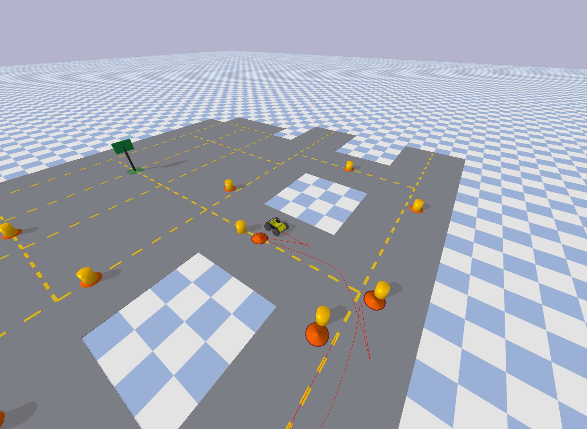

# Autonomous Airport Luggage Robot — PyBullet Simulation

A physics-based simulation of an autonomous luggage-transport robot navigating 
a multi-segment airport taxiway network, built in PyBullet. The robot plans 
routes with A*, tracks the taxiway centreline using lookahead pursuit steering, 
and detects and avoids obstacles in real time via a reactive recovery sequence 
(stop → reverse → detour → rejoin).



Future roadmap includes ROS2 integration.

---
Feel free to explore the code, open an issue, or build on top of it. 
Contributions and ideas are welcome!
---

## Features

- **A\* path planning** over a dynamic occupancy grid covering the full
  taxiway network (main taxiway, parallel service road, cross-connectors,
  and a gated apron)
- **Pure-pursuit path tracking** — the robot follows a lookahead point
  projected onto the road centreline rather than chasing discrete
  waypoints, for smoother and more accurate lane-following
- **Reactive collision recovery** — on contact with an obstacle, the robot
  stops, reverses clear, plans a short detour around the blocked area, and
  rejoins the original route
- **Persistent obstacle memory** — collision locations are saved to
  `learned_obstacles.json` and reloaded on the next run, so previously
  discovered obstacles are avoided from the start of future simulation
  episodes
- **Dual path visualisation** — a fixed yellow line shows the planned ideal
  route, while a live red trail traces the robot's actual driven path,
  making divergence (e.g. during a detour) immediately visible
- **Free-roam debug camera** — pan and orbit with the arrow keys and mouse
  to inspect the simulation from any angle while it runs

## Motivation

This project was inspired by home cleaning robots and food/package delivery
robots, adapted for an airport-transport context. It started as a single-corridor
pathfinding demo and was iteratively rebuilt into a fuller simulation environment
for testing navigation and obstacle-avoidance logic without physical hardware.

The focus throughout has been on making the system observable and debuggable,
visual route overlays, state-machine driven recovery behaviour, and persistent
memory across runs, rather than simply "does it get to the goal".

## Tech stack

- [PyBullet](https://pybullet.org/) — physics simulation and rendering
- Python 3.10
- A* search with a custom grid-based occupancy map
- No external ML libraries — obstacle memory is a simple persisted
  coordinate list, not a trained model (see [Architecture](#architecture))

## Getting started

### Prerequisites

- Python 3.10+ (a virtual environment is strongly recommended)
- macOS users: PyBullet's bundled zlib has a known build issue on macOS 15
  with recent Xcode command line tools — see [Troubleshooting](#troubleshooting)
  if `pip install pybullet` fails to compile.

### Installation

```bash
git clone https://github.com/swyou1214/airport-robot-sim.git
cd airport-robot-sim
python3 -m venv venv
source venv/bin/activate          # macOS/Linux
pip install pybullet
```

### Running the simulation

```bash
python3 robot_sim.py
```

A PyBullet window opens showing the robot at the depot. It will plan a
route, then drive it automatically. Use the arrow keys to move the camera,
or drag with the mouse to orbit.

## Architecture

| Component | What it does |
|---|---|
| `ROAD_SEGMENTS` | Defines the taxiway network as a list of straight line segments |
| `a_star()` | Plans a route across a 0.5m grid, avoiding blocked cells |
| `ideal_route` | The literal centreline path the robot tracks — fixed for the whole run |
| `lookahead_point_on_route()` | Pure-pursuit style steering: projects the robot onto the route and aims a fixed distance ahead |
| State machine (`DRIVING` / `REVERSING` / `REJOINING`) | Governs collision recovery: stop, back away, plan a local detour, rejoin |
| `learned_obstacles.json` | Persists collision coordinates between runs — **not** a trained model, just a saved coordinate list reloaded into the planning grid on startup |

### A note on "learning"

`learned_obstacles.json` is intentionally simple: it's a list of (x, y)
points where the robot has previously collided, blocked out in the
planning grid on the next run. It's best described as **persistent
episode memory**, not machine learning — there's no model, no training,
and no generalisation beyond the exact points recorded. A natural next
step would be an occupancy grid with Bayesian probability updates, which
would generalise to nearby cells rather than only the exact collision
point.

## Project structure

```
.
├── robot_sim.py            # main simulation script
├── learned_obstacles.json  # generated at runtime, gitignored
├── README.md
└── docs/
    └── screenshot.png
```

## Troubleshooting

<details>
<summary>pip install pybullet fails to compile on macOS 15</summary>

PyBullet 3.2.7 bundles a vendored copy of zlib whose `fdopen` macro
conflicts with the macOS 15 SDK's own `fdopen` declaration. Fix:

```bash
pip download pybullet --no-binary :all: --no-deps -d /tmp/pybullet_src
cd /tmp/pybullet_src
tar xzf pybullet-*.tar.gz
cd pybullet-*/
sed -i '' '128d' examples/ThirdPartyLibs/zlib/zutil.h
pip install .
```
</details>

## License

MIT
